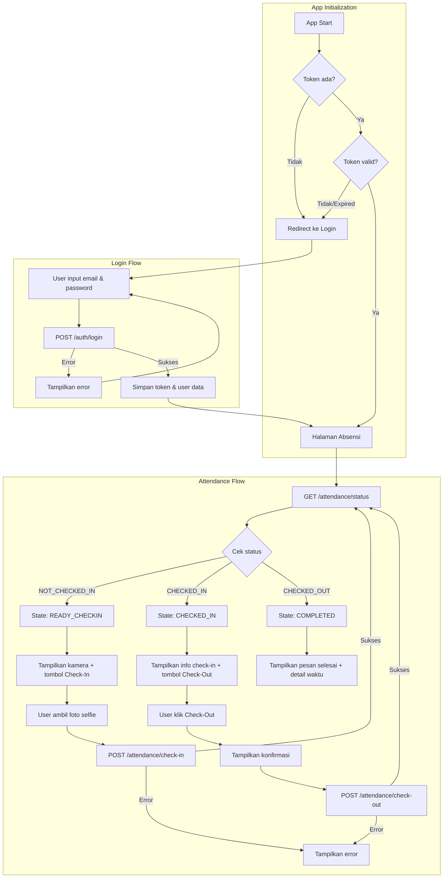

# Employee Portal - Frontend Integration Brief

## Ringkasan

Dokumen ini adalah brief integrasi untuk **Employee Portal** - aplikasi web yang digunakan oleh karyawan untuk melakukan absensi harian (check-in dan check-out). Dokumen ditujukan untuk AI agent frontend agar memahami seluruh endpoint, format data, dan flow aplikasi yang harus diimplementasikan.

> [!IMPORTANT]
> Dokumen ini fokus pada **flow Employee** untuk keperluan absensi, bukan untuk admin dashboard.

---

## Konfigurasi Dasar

| Item | Value |
|------|-------|
| **Base URL** | `http://localhost:3000` |
| **Content-Type** | `application/json` |
| **Authentication** | Bearer Token (JWT) |
| **Target User Role** | `EMPLOYEE` |

### Format Response Standar

Semua response API dibungkus dalam format berikut:

```json
{
  "statusCode": 200,
  "message": "Pesan deskriptif",
  "data": { ... },
  "success": true
}
```

---

## API Contract

### 1. Login

Autentikasi employee ke sistem.

| Property | Value |
|----------|-------|
| **Method** | `POST` |
| **Endpoint** | `/auth/login` |
| **Auth Required** | ❌ Tidak |

#### Request Body

| Field | Type | Required | Validation |
|-------|------|----------|------------|
| `email` | `string` | ✅ | Format email valid |
| `password` | `string` | ✅ | Tidak boleh kosong |

#### Response Sukses (200)

```json
{
  "statusCode": 200,
  "message": "Login successful",
  "data": {
    "access_token": "eyJhbGciOiJIUzI1NiIs...",
    "user": {
      "id": "uuid",
      "email": "john.doe@dexa.com",
      "name": "John Doe",
      "role": "EMPLOYEE"
    }
  },
  "success": true
}
```

#### Response Error (401)

```json
{
  "statusCode": 401,
  "message": "Invalid credentials",
  "success": false
}
```

#### Catatan Penting

- Token berlaku selama **24 jam**
- Simpan token di secure storage
- Format penggunaan: `Authorization: Bearer <token>`

---

### 2. Cek Status Absensi

Mengecek status check-in employee pada hari ini. **Endpoint ini WAJIB dipanggil setiap kali masuk ke halaman absensi** untuk menentukan UI yang ditampilkan.

| Property | Value |
|----------|-------|
| **Method** | `GET` |
| **Endpoint** | `/attendance/status` |
| **Auth Required** | ✅ Ya |

#### Response Fields

| Field | Type | Description |
|-------|------|-------------|
| `status` | `string` | Status absensi: `NOT_CHECKED_IN`, `CHECKED_IN`, `CHECKED_OUT` |
| `message` | `string` | Pesan deskriptif untuk ditampilkan |
| `currentAttendance` | `object \| null` | Data absensi hari ini (jika ada) |

#### Response - Belum Check-In (`NOT_CHECKED_IN`)

Employee belum melakukan check-in hari ini.

```json
{
  "statusCode": 200,
  "data": {
    "status": "NOT_CHECKED_IN",
    "message": "Anda belum check-in hari ini. Silakan check-in.",
    "currentAttendance": null
  },
  "success": true
}
```

**UI Action**: Tampilkan tombol **Check-In** dan aktifkan kamera.

---

#### Response - Sudah Check-In (`CHECKED_IN`)

Employee sudah check-in dan perlu check-out.

```json
{
  "statusCode": 200,
  "data": {
    "status": "CHECKED_IN",
    "message": "Anda sudah check-in hari ini. Silakan check-out.",
    "currentAttendance": {
      "id": "uuid",
      "userId": "uuid",
      "checkInTime": "2025-12-18T02:23:25.589Z",
      "photoUrl": "uploads/filename.jpg",
      "checkOutTime": null,
      "user": {
        "id": "uuid",
        "email": "john.doe@dexa.com",
        "name": "John Doe",
        "role": "EMPLOYEE"
      }
    }
  },
  "success": true
}
```

**UI Action**: Tampilkan tombol **Check-Out** dan info waktu check-in.

---

#### Response - Absensi Selesai (`CHECKED_OUT`)

Employee sudah menyelesaikan check-in dan check-out hari ini.

```json
{
  "statusCode": 200,
  "data": {
    "status": "CHECKED_OUT",
    "message": "Anda sudah menyelesaikan absensi hari ini.",
    "currentAttendance": {
      "id": "uuid",
      "checkInTime": "2025-12-18T02:23:25.589Z",
      "checkOutTime": "2025-12-18T10:30:00.000Z",
      ...
    }
  },
  "success": true
}
```

**UI Action**: Tampilkan pesan selesai dan detail waktu check-in/check-out.

---

### 3. Check-In

Melakukan check-in dengan upload foto selfie.

| Property | Value |
|----------|-------|
| **Method** | `POST` |
| **Endpoint** | `/attendance/check-in` |
| **Auth Required** | ✅ Ya |
| **Content-Type** | `multipart/form-data` |

#### Request Body (FormData)

| Field | Type | Required | Description |
|-------|------|----------|-------------|
| `photo` | `File` | ✅ | Foto selfie (jpg, jpeg, png, gif, webp) |

#### Response Sukses (200)

```json
{
  "statusCode": 200,
  "message": "Check-in successful",
  "data": {
    "id": "uuid",
    "userId": "uuid",
    "checkInTime": "2025-12-18T09:00:00.000Z",
    "photoUrl": "uploads/photo-123.jpg",
    "checkOutTime": null,
    "user": { ... }
  },
  "success": true
}
```

#### Response Error (400)

```json
{
  "statusCode": 400,
  "message": "You have already checked in today and have not checked out",
  "success": false
}
```

---

### 4. Check-Out

Melakukan check-out untuk mengakhiri absensi hari ini.

| Property | Value |
|----------|-------|
| **Method** | `POST` |
| **Endpoint** | `/attendance/check-out` |
| **Auth Required** | ✅ Ya |

#### Request Body

Tidak ada body, kirim request kosong atau `{}`.

#### Response Sukses (200)

```json
{
  "statusCode": 200,
  "message": "Check-out successful",
  "data": {
    "id": "uuid",
    "checkInTime": "2025-12-18T09:00:00.000Z",
    "checkOutTime": "2025-12-18T17:30:00.000Z",
    ...
  },
  "success": true
}
```

#### Response Error (400)

```json
{
  "statusCode": 400,
  "message": "No active check-in found for today",
  "success": false
}
```

---

### 5. Riwayat Absensi

Mendapatkan riwayat absensi employee.

| Property | Value |
|----------|-------|
| **Method** | `GET` |
| **Endpoint** | `/attendance/my` |
| **Auth Required** | ✅ Ya |

#### Query Parameters

| Param | Type | Default | Description |
|-------|------|---------|-------------|
| `page` | `number` | `1` | Nomor halaman |
| `limit` | `number` | `10` | Item per halaman |
| `startDate` | `string` | - | Filter tanggal mulai (ISO) |
| `endDate` | `string` | - | Filter tanggal akhir (ISO) |

#### Response Sukses (200)

```json
{
  "statusCode": 200,
  "data": {
    "data": [
      {
        "id": "uuid",
        "checkInTime": "2025-12-18T09:00:00.000Z",
        "checkOutTime": "2025-12-18T17:30:00.000Z",
        "photoUrl": "uploads/photo.jpg",
        ...
      }
    ],
    "meta": {
      "total": 30,
      "page": 1,
      "limit": 10,
      "totalPages": 3
    }
  },
  "success": true
}
```

---

## Struktur Halaman

| Halaman | Route | Deskripsi | Auth |
|---------|-------|-----------|------|
| Login | `/login` | Form login employee | ❌ |
| Absensi | `/` atau `/attendance` | Halaman utama absensi | ✅ |
| Riwayat | `/history` | Daftar riwayat absensi | ✅ |

---

## Application Flow

### Flow Diagram



---

## Detail Implementasi per Halaman

### 1. Login Page

#### Komponen UI

- Logo/Brand aplikasi
- Form input email
- Form input password
- Tombol Login dengan loading state
- Area error message

#### Logic

1. Jika sudah login (token valid), redirect ke halaman absensi
2. Validasi input sebelum submit
3. Panggil `POST /auth/login`
4. Jika sukses → simpan token, redirect ke absensi
5. Jika gagal → tampilkan pesan error

---

### 2. Attendance Page (Halaman Utama)

#### Komponen UI

| Komponen | Deskripsi |
|----------|-----------|
| **Header** | Nama employee, tanggal hari ini, tombol logout |
| **Clock Display** | Jam digital real-time (update setiap detik) |
| **Camera Preview** | Preview webcam untuk selfie (saat mode check-in) |
| **Action Button** | Tombol dinamis sesuai status |
| **Status Card** | Info status dan waktu check-in/check-out |

#### State Management

```
AttendancePageState:
  - status: 'loading' | 'NOT_CHECKED_IN' | 'CHECKED_IN' | 'CHECKED_OUT' | 'error'
  - currentAttendance: object | null
  - isSubmitting: boolean
  - errorMessage: string | null
```

#### Logic berdasarkan Status

| Status dari API | UI yang Ditampilkan |
|-----------------|---------------------|
| `NOT_CHECKED_IN` | Kamera aktif, tombol "Check-In" |
| `CHECKED_IN` | Info waktu check-in, tombol "Check-Out" |
| `CHECKED_OUT` | Info lengkap, semua tombol disabled |

#### Check-In Flow Detail

1. Status = `NOT_CHECKED_IN`
2. Aktifkan webcam (minta permission jika belum)
3. Tampilkan live preview
4. User klik tombol "Capture" atau "Ambil Foto"
5. Tampilkan preview foto
6. User klik "Check-In"
7. Convert foto ke File/Blob
8. Buat FormData dengan field `photo`
9. Panggil `POST /attendance/check-in`
10. Jika sukses → refresh status
11. Jika gagal → tampilkan error

#### Check-Out Flow Detail

1. Status = `CHECKED_IN`
2. Tampilkan info waktu check-in
3. User klik tombol "Check-Out"
4. Tampilkan dialog konfirmasi
5. User konfirmasi
6. Panggil `POST /attendance/check-out`
7. Jika sukses → refresh status
8. Jika gagal → tampilkan error

---

### 3. History Page

#### Komponen UI

- List/table riwayat absensi
- Pagination controls
- Filter tanggal (opsional)

#### Data yang Ditampilkan

| Kolom | Deskripsi |
|-------|-----------|
| Tanggal | Format: DD MMM YYYY |
| Jam Masuk | Format: HH:mm |
| Jam Keluar | Format: HH:mm atau "-" |
| Durasi | Selisih jam keluar - jam masuk |

---

## Technical Requirements

### 1. HTTP Client Setup

- Buat instance axios/fetch dengan base URL
- Tambahkan request interceptor untuk attach token
- Tambahkan response interceptor untuk handle 401 (redirect ke login)

### 2. Auth Guard

- Cek keberadaan token sebelum akses protected route
- Decode JWT untuk cek expiry (opsional)
- Redirect ke login jika tidak authenticated

### 3. Webcam/Camera

- Request permission camera
- Gunakan front-facing camera (selfie mode)
- Capture frame ke canvas
- Convert canvas ke Blob/File
- Format yang diterima: jpg, jpeg, png, gif, webp

### 4. Real-time Clock

- Update setiap detik
- Format: HH:mm:ss
- Locale: Indonesia

---

## Error Handling

| Situasi | HTTP Code | Aksi Frontend |
|---------|-----------|---------------|
| Credentials salah | 401 | Tampilkan "Email atau password salah" |
| Token expired | 401 | Clear storage, redirect ke login |
| Sudah check-in | 400 | Tampilkan error, refresh status |
| Belum check-in (saat checkout) | 400 | Tampilkan error, refresh status |
| Network error | - | Tampilkan "Koneksi bermasalah" |
| Server error | 500 | Tampilkan "Terjadi kesalahan" |

---

## Test Accounts

| Email | Password | Role |
|-------|----------|------|
| `john.doe@dexa.com` | `employee123` | EMPLOYEE |
| `jane.smith@dexa.com` | `employee123` | EMPLOYEE |
| `bob.wilson@dexa.com` | `employee123` | EMPLOYEE |

---

## Type Definitions

```typescript
// Attendance Status Enum
type AttendanceStatus = 'NOT_CHECKED_IN' | 'CHECKED_IN' | 'CHECKED_OUT';

interface User {
  id: string;
  email: string;
  name: string;
  role: 'EMPLOYEE' | 'ADMIN';
}

interface LoginResponse {
  access_token: string;
  user: User;
}

interface AttendanceRecord {
  id: string;
  userId: string;
  checkInTime: string;
  photoUrl: string;
  checkOutTime: string | null;
  user?: User;
}

interface CheckInStatusResponse {
  status: AttendanceStatus;
  message: string;
  currentAttendance?: AttendanceRecord;
}

interface PaginatedResponse<T> {
  data: T[];
  meta: {
    total: number;
    page: number;
    limit: number;
    totalPages: number;
  };
}

interface ApiResponse<T> {
  statusCode: number;
  message: string;
  data: T;
  success: boolean;
}
```

---

## Checklist Implementasi

### Halaman & Routing

- [ ] Setup routing (Login, Attendance, History)
- [ ] Implementasi auth guard untuk protected routes
- [ ] Redirect logic berdasarkan auth state

### Login

- [ ] Form email dan password
- [ ] Validasi input
- [ ] Integrasi API login
- [ ] Token storage
- [ ] Error handling

### Attendance

- [ ] Fetch status saat page load
- [ ] Webcam integration
- [ ] Capture foto
- [ ] Check-in dengan upload foto
- [ ] Tampilan info check-in time
- [ ] Check-out dengan konfirmasi
- [ ] Tampilan completed state
- [ ] Real-time clock
- [ ] Loading states

### History (Opsional)

- [ ] Fetch riwayat absensi
- [ ] Tampilan list/table
- [ ] Pagination
- [ ] Filter tanggal

### Global

- [ ] HTTP client dengan interceptors
- [ ] Logout functionality
- [ ] Error handling global
- [ ] Responsive design
